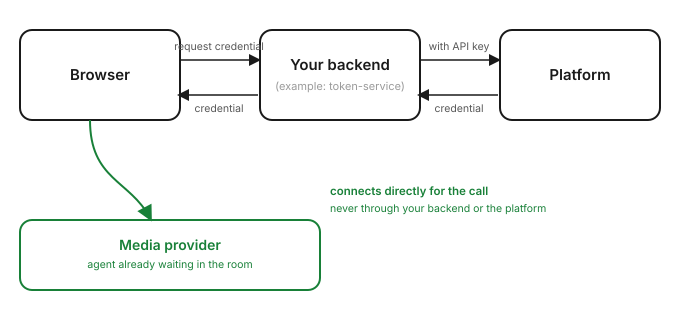

# webrtc-client-quickstart

Reference implementation for connecting a browser to a platform agent over
WebRTC — a token-issuing backend plus a working webphone example.

## ⚠️ This is an example, not something to deploy as-is

Everything here is illustrative. In particular, **`token-service/` is a
reference, not a real backend** — it has no authentication and no rate
limiting, so anyone who can reach it can start calls on your behalf. Don't
run it in production.

Each integrator should build their own version of it, in their own stack,
following the same shape:

- Hold your platform API key server-side. It must never reach the browser.
- Authenticate your own callers however your app already does.
- Once authenticated, derive the conversation identity (`continuity_key`)
  from that session — don't trust it from the browser. See
  `token-service/main.py`'s docstring for why.

## How it works

```
browser → your backend → platform → browser
```

Your backend exchanges your API key for a short-lived, call-scoped
credential. The browser uses that credential to connect directly for the
call itself — your backend and the platform aren't in the media path.



## Try the example locally

```bash
cd token-service && cp .env.example .env   # fill in API_KEY + CHANNEL_DEFINITION_ID
cd ..

just serve-backend    # token-service on :8080
just serve-example    # the repo on :5500 — open :5500/example/
```

`just test` checks the example backend without needing a real API key.
`just check` syntax-checks everything. See the `justfile` for all commands.

## Layout

- `token-service/` — example backend. Replace with your own.
- `example/` — a working webphone widget (call, mute, hang up, audio meters).
- `docs/architecture.svg` — the diagram above.

## Not included

Audio only for now. One call at a time. No mobile SDKs.
